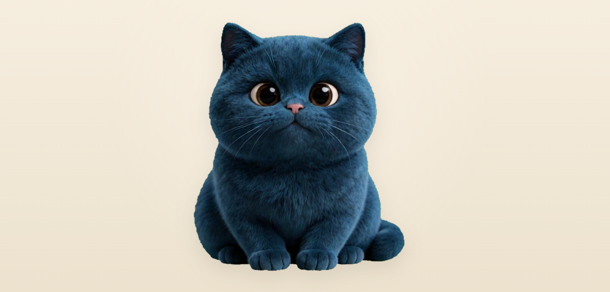

# KaMenisCat



KaMenisCat 是一个会跟随鼠标方向转头的互动猫咪网页。项目从绿幕视频中抽帧、抠图并生成精细的 WebP sprite，让猫咪在页面中根据鼠标位置自然地看向上、下、左、右和各个斜向。

## 功能

- 鼠标方向追踪：猫咪会根据鼠标所在方向转头。
- 细腻转向：使用 72 档方向帧，并在相邻帧之间做过渡。
- 透明抠图：从纯绿色背景视频中自动抠出猫咪主体。
- 莫兰迪色盘：底部可以切换柔和背景色，也支持自定义颜色。
- 猫咪资料：右上角设置按钮可填写猫咪姓名、出生日期和电话。
- 当前链接二维码：设置面板会生成当前页面 URL 的二维码，部署到线上后会自动变成线上链接。

## 本地预览

在项目目录中启动一个静态服务器：

```bash
python -m http.server 8765 --bind 127.0.0.1
```

然后打开：

```text
http://127.0.0.1:8765/index.html
```

## Cloudflare Pages 部署

这个项目是纯静态页面，可以直接部署到 Cloudflare Pages。

推荐设置：

- Framework preset: `None`
- Build command: 留空
- Build output directory: `/`

部署完成后，页面里的二维码会读取 `window.location.href`，自动生成 Cloudflare Pages 当前线上地址的二维码。

## 主要文件

- `index.html`：互动页面主体。
- `frame_front.webp`：猫咪正面中心帧。
- `sprite-row-0.webp` 到 `sprite-row-5.webp`：运行时使用的分行 sprite atlas。
- `sprite.webp`：完整 sprite atlas。
- `asset-meta.json`：帧尺寸、角度映射和素材元数据。
- `make_assets.py`：从视频生成透明 WebP 素材的脚本。
- `qrcode.min.js`：本地二维码生成库。
