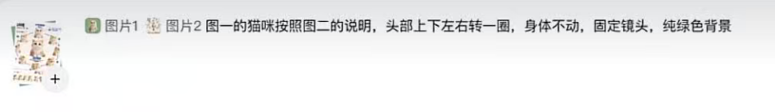
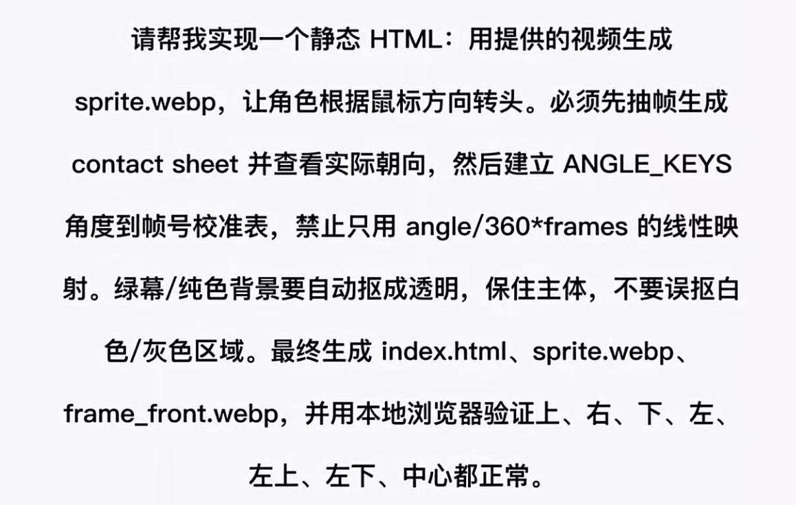
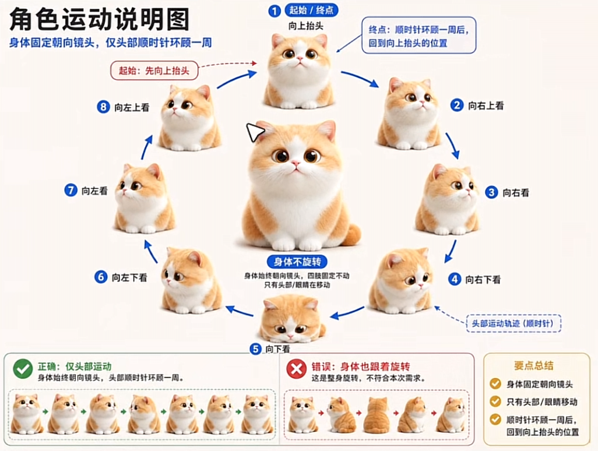

# KaMenisACat


## 博主独白

博主家里一个蓝猫，取名叫卡门，朋友送的，跟了我很多年了，大概在 2014 年收养的，到现在十多年了，身体依然健康，愿天下的猫猫狗狗都平平安安的。这个项目欢迎自己去 DIY。谢谢大家。

## 项目介绍

KaMenisACat 是一个会跟随鼠标方向转头的互动猫咪网页。项目从绿幕视频中抽帧、抠图并生成精细的 WebP sprite，让猫咪在页面中根据鼠标位置自然地看向上、下、左、右和各个斜向。

## 功能

- 鼠标方向追踪：猫咪会根据鼠标所在方向转头。
- 细腻转向：使用 72 档方向帧，并在相邻帧之间做过渡。
- 透明抠图：从纯绿色背景视频中自动抠出猫咪主体。
- 莫兰迪色盘：底部可以切换柔和背景色，也支持自定义颜色。
- 猫咪资料：右上角设置按钮可填写猫咪姓名、出生日期和电话。
- 当前链接二维码：设置面板会生成当前页面 URL 的二维码，部署到线上后会自动变成线上链接。

## 生图提示词与制作要求

### 视频生成提示词



文字版：

```text
图片1，图片2，图一的猫咪按照图二的说明，头部上下左右转一圈，身体不动，固定镜头，纯绿色背景
```

### 静态 HTML 制作要求



核心要求：

- 用提供的视频生成透明 sprite 素材。
- 角色根据鼠标方向转头。
- 必须先抽帧生成 contact sheet，并查看实际朝向。
- 建立 `ANGLE_KEYS` 角度到帧号校准表。
- 禁止只用 `angle / 360 * frames` 的线性映射。
- 绿幕或纯色背景要自动抠成透明，保住主体，不要误抠白色和灰色区域。
- 最终生成 `index.html`、`sprite-row-*.webp`、`frame_front.webp`。
- 用本地浏览器验证上、右、下、左、左上、左下、中心都正常。

### 角色运动说明图



运动参考：

- 身体固定朝向镜头。
- 仅头部和眼睛移动。
- 头部顺时针环顾一周。
- 回到向上抬头的位置。
- 固定镜头，不缩放镜头。
- 纯绿色背景，方便后期抠图。

## 本地预览

在项目目录中启动一个静态服务器：

```bash
python -m http.server 8765 --bind 127.0.0.1
```

然后打开：

```text
http://127.0.0.1:8765/index.html
```

## Cloudflare Pages 部署

这个项目是纯静态页面，可以直接部署到 Cloudflare Pages。

推荐设置：

- Framework preset: `None`
- Build command: 留空
- Build output directory: `/`

部署完成后，页面里的二维码会读取 `window.location.href`，自动生成 Cloudflare Pages 当前线上地址的二维码。

## 主要文件

- `index.html`：互动页面主体。
- `frame_front.webp`：猫咪正面中心帧。
- `sprite-row-0.webp` 到 `sprite-row-5.webp`：运行时使用的分行 sprite atlas。
- `asset-meta.json`：帧尺寸、角度映射和素材元数据。
- `make_assets.py`：从视频生成透明 WebP 素材的脚本。
- `qrcode.min.js`：本地二维码生成库。
